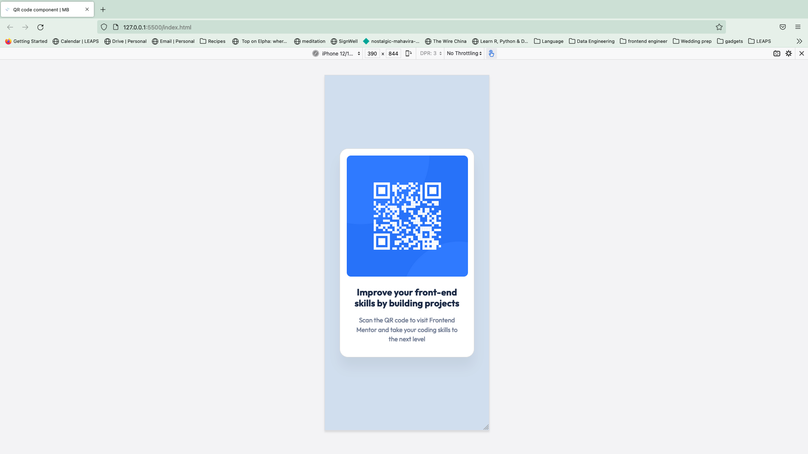

# Frontend Mentor - QR code component solution

This is a solution to the [QR code component challenge on Frontend Mentor](https://www.frontendmentor.io/challenges/qr-code-component-iux_sIO_H). Frontend Mentor challenges help you improve your coding skills by building realistic projects.

## Table of contents

- [Overview](#overview)
  - [Screenshot](#screenshot)
  - [Links](#links)
- [My process](#my-process)
  - [Built with](#built-with)
  - [What I learned](#what-i-learned)
  - [Continued development](#continued-development)
  - [Useful resources](#useful-resources)
- [Author](#author)

**Note: Delete this note and update the table of contents based on what sections you keep.**

## Overview

### Screenshot

Desktop version


mobile version


### Links

- Solution URL: [Add solution URL here](https://your-solution-url.com)
- Live Site URL: [Add live site URL here](https://your-live-site-url.com)

## My process

### Built with

- HTML
- CSS custom properties
- Bootstrap
- Flexbox
- CSS Grid
- Mobile-first workflow

### What I learned

- how to import a font to the css file and that it's important to import all the needed styles if using google fonts

```css
@import url("https://fonts.googleapis.com/css2?family=Outfit:wght@100;200;300;400;500;600;700&display=swap");
```

- sometimes the code is overwritten and there is a need to add

```css
!important;
```

after the desired value.

### Continued development

It would be helpful to understand the reason why some added values in CSS need "!important" to actually show up.

I want to learn more about :

- bootstrap and it's capabilities
- how to center any element in the screen regardless of the screen/browser/device used

### Useful resources

- [using variables in css ](https://developer.mozilla.org/en-US/docs/Web/CSS/Using_CSS_custom_properties) - This helped me remember to use a variable in css after creating it

- [Google fonts ](https://fonts.google.com/specimen/Outfit?query=Outfit) - This helped me find the relevant font that the designer wanted

- [MDN Web Doc ](https://developer.mozilla.org/en-US/docs/Web/CSS/font-weight) - This helped me find the different weights that a text could have the corresponding value to each categoty "normal = 400" etc ...

- [CSS Tricks ](https://css-tricks.com/quick-css-trick-how-to-center-an-object-exactly-in-the-center/) - This helped me center the card element.

## Author

- Website - [Mariem Bchir](https://goofy-easley-2c8717.netlify.app/index.html)

- Frontend Mentor - [@Mabchir](https://www.frontendmentor.io/profile/yourusername)

- Github - [Mabchir](https://github.com/Mabchir)
